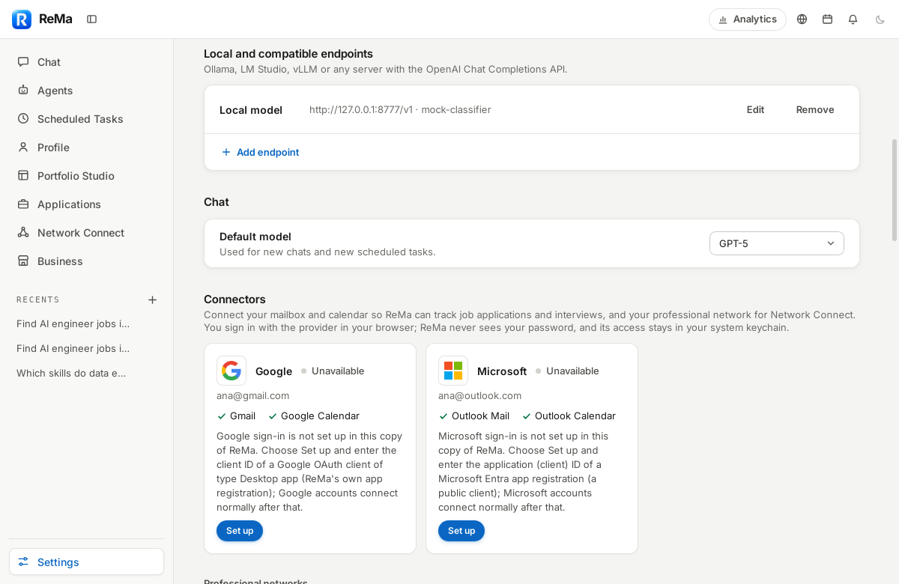
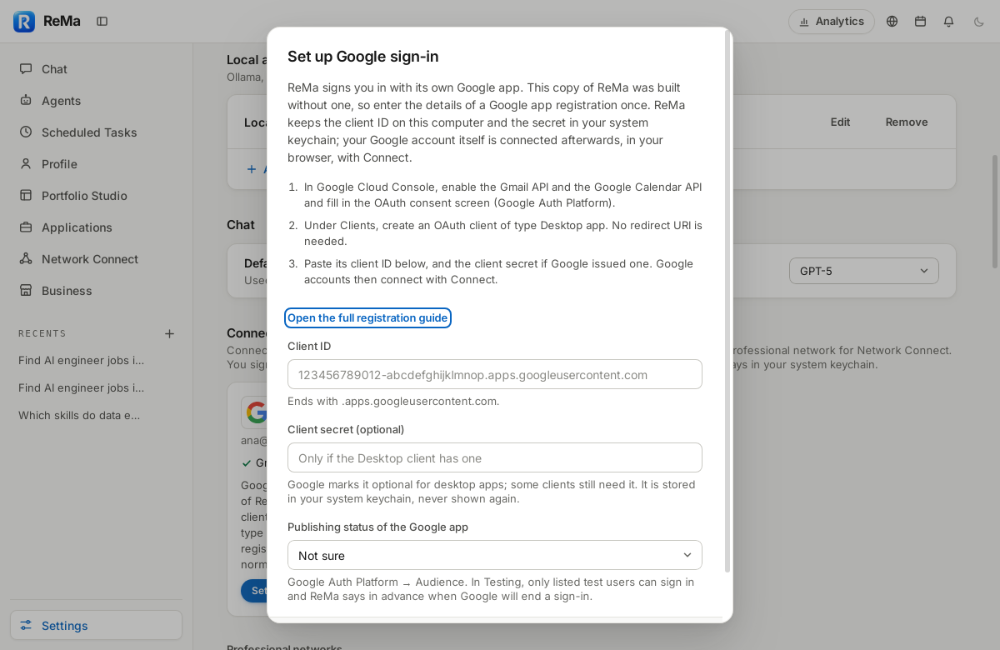

# Connectors — app registration

ReMa signs users in with **its own** Google, Microsoft and LinkedIn app registrations.
Official builds carry them, so users of a release never create OAuth clients,
never see a client ID or secret, and never open a cloud console. This page is
for whoever publishes a build, and for anyone running a copy of ReMa that was
built without a registration (a development build, for example): such a copy
takes the registration **inside the app**, no terminal needed.

## Setting it up inside ReMa (Settings → Connectors → Set up)

A card whose provider this copy of ReMa has no registration for says so and
shows **Set up** instead of Connect. The dialog lists the steps for the
provider's console (they are the same as in the sections below), takes the
values, checks their format and makes the sign-in available at once: Connect
appears, and the account is connected in the browser as usual.

| Provider | What Set up asks for |
|---|---|
| Google | the client ID of an OAuth client of type **Desktop app**; optionally its client secret; optionally the app's publishing status (Testing or Production) |
| Microsoft | the Application (client) ID of a public-client app registration (the tenant is always `common`: any organization and personal accounts) |
| LinkedIn | the client ID of an app with native PKCE enabled; optionally the restricted scopes LinkedIn approved (`r_1st_connections`) |

Where it goes: the public values in `connectors.toml` in ReMa's data folder
(macOS: `~/Library/Application Support/cloud.datasound.rema/connectors.toml`;
Linux: `~/.local/share/cloud.datasound.rema/connectors.toml`; the same tables
and keys as `src-tauri/connectors.toml`, so the file can also be written by
hand), and the Google client secret in the **system keychain** (account
`connector-app:google:client_secret`), never in a file, a log or the
interface. A registration in the build always wins; Set up never overrides
it, and a build that carries a provider's registration offers no Set up for
it. **App registration** on a card opens the same dialog again to change the
secret or the publishing status, or to remove the registration; a connected
account keeps its registration (its sign-in belongs to that client ID), so
changing the client ID or removing it asks for a disconnect first. What the
provider itself refuses (a wrong secret, an unverified app, a missing API)
shows on the card at the first sign-in, as for any registration.





Implementation: `src-tauri/src/connectors/registrations.rs`; commands
`set_app_registration` and `remove_app_registration`; the interface's
`AppRegistrationDialog`.

> These steps follow Google's and Microsoft's documentation for installed
> apps. The documentation hosts (`developers.google.com`,
> `learn.microsoft.com`) were not reachable from the environment this was
> written in; check the current console labels against the official pages
> linked below before registering.

## Build configuration

The registrations live in **`src-tauri/connectors.toml`**, committed with
the source, and are compiled into every build by `build.rs`
(`src-tauri/src/connectors/build_config.rs` checks them, the app reads them
from `connectors::config`). A variable with the same name as in the file
overrides a value, for example in the release workflow:

| `connectors.toml` | Variable | Required | Meaning |
|---|---|---|---|
| `[google] desktop_client_id` | `GOOGLE_DESKTOP_CLIENT_ID` | release | Google OAuth client of type **Desktop app** (`….apps.googleusercontent.com`) |
| `[google] desktop_client_secret` | `GOOGLE_DESKTOP_CLIENT_SECRET` | no | that client's secret. Google's current native-app documentation marks it optional at the token endpoint, and Google does not treat it as confidential for installed apps; some registered Desktop clients still answer `invalid_request: client_secret is missing` without it, in which case set it. A build with the client ID alone is allowed; token requests omit the field when it is empty. It is public configuration, never a security boundary, and never shown or logged |
| `[microsoft] public_client_id` | `MICROSOFT_PUBLIC_CLIENT_ID` | release | Microsoft Entra application (client) ID (a GUID) of a public client |
| `[microsoft] tenant` | `MICROSOFT_TENANT` | no (default `common`) | `common` (work, school and personal accounts); release builds refuse a single tenant |
| `[linkedin] client_id` | `LINKEDIN_CLIENT_ID` | no | client ID of a LinkedIn app with native PKCE enabled; no secret exists or ships |
| `[linkedin] approved_scopes` | `LINKEDIN_APPROVED_SCOPES` | no | restricted scopes LinkedIn approved for that app, space-separated; only `r_1st_connections` is recognised |

**A release build fails** (`cargo build --release`, `pnpm build:app`, the
release workflow) when a Google or Microsoft value is missing or malformed,
listing what is missing. It can therefore never ship connectors that say
"sign-in is not available". A development build without them compiles with
one Cargo warning, and the affected cards say how to add the registration.

These values are identifiers of ReMa's own app registrations. They ship
inside every copy of ReMa (desktop apps are public OAuth clients), users
never see or enter them, and hiding them would protect nothing: the user's
tokens are what is protected (system keychain, PKCE, `state`, loopback
redirect).

```sh
# The release workflow (.github/workflows/release.yml) reads the Actions
# variables GOOGLE_DESKTOP_CLIENT_ID and MICROSOFT_PUBLIC_CLIENT_ID and the
# Actions secret GOOGLE_DESKTOP_CLIENT_SECRET. Locally:
GOOGLE_DESKTOP_CLIENT_ID=… GOOGLE_DESKTOP_CLIENT_SECRET=… MICROSOFT_PUBLIC_CLIENT_ID=… pnpm build:app
```

Pushing a Google client secret into a public repository can trip GitHub's
secret scanning even though Google treats it as non-confidential; keeping
it in the Actions secret avoids that.

**Every build also reads `connectors.toml` in ReMa's data folder** (the
file Set up writes, see above), with the same tables and keys as
`src-tauri/connectors.toml`. It completes what the build lacks and never
overrides it; a malformed file is reported by key in the log and ignored.
Release builds carry every registration already, so for them the file
changes nothing. A build without a registration says so on the card and
offers Set up (`connectors::unavailable_reason`).

**Development only** (ignored by release builds): `REMA_DEV_GOOGLE_CLIENT_ID`,
`REMA_DEV_GOOGLE_CLIENT_SECRET`, `REMA_DEV_MICROSOFT_CLIENT_ID`,
`REMA_DEV_LINKEDIN_CLIENT_ID` and `REMA_DEV_LINKEDIN_APPROVED_SCOPES` override
the registration at run time; `REMA_GOOGLE_BASE_URL`, `REMA_MICROSOFT_BASE_URL`
and `REMA_LINKEDIN_BASE_URL` point the endpoints at a local mock (see
[validation.md](validation.md) and
[network-connect/validation.md](../network-connect/validation.md)).

## Google (Gmail, Google Calendar)

Official guides: [OAuth 2.0 for iOS & Desktop Apps](https://developers.google.com/identity/protocols/oauth2/native-app),
[Gmail API scopes](https://developers.google.com/workspace/gmail/api/auth/scopes),
[Calendar API scopes](https://developers.google.com/workspace/calendar/api/auth),
[OAuth app verification](https://support.google.com/cloud/answer/13463073).

1. Create (or choose) a Google Cloud project owned by the publisher.
2. **APIs & Services → Library**: enable the **Gmail API** and the **Google Calendar API**.
3. **Google Auth Platform → Branding** (OAuth consent screen): app name "ReMa", support email, logo, home page, privacy policy and terms of service URLs, authorized domain of those pages, developer contact.
4. **Audience**: user type **External**. While the app is in *Testing*, only listed test users can sign in, and Google ends their sign-ins about 7 days after they are made (users then see "Reconnect needed" in ReMa; a build made with `GOOGLE_PUBLISHING_STATUS=testing` says so on the card, with an estimated end date).
5. **Data access**: add exactly these scopes:
   - `openid`, `…/auth/userinfo.email` (`email`), `…/auth/userinfo.profile` (`profile`)
   - `https://www.googleapis.com/auth/gmail.readonly` (restricted)
   - `https://www.googleapis.com/auth/calendar.events` (sensitive)
   - `https://www.googleapis.com/auth/calendar.freebusy`
6. **Clients → Create client → Application type: Desktop app.** No redirect URI is configured: desktop clients accept loopback redirects (`http://127.0.0.1:<any port>`), which is what ReMa uses.
7. Put the client ID and secret into `connectors.toml` or the release variables above.
8. Before publishing to everyone: complete **verification** (see [compliance.md](compliance.md)).

What ReMa sends: `response_type=code`, `code_challenge` (S256), a random
`state`, `access_type=offline` (refresh token), `prompt=consent
select_account`, and only the scopes of the connectors being enabled.

## Microsoft (Outlook Mail, Outlook Calendar)

Official guides: [Register an application](https://learn.microsoft.com/entra/identity-platform/quickstart-register-app),
[Redirect URI (reply URL) restrictions — localhost](https://learn.microsoft.com/entra/identity-platform/reply-url),
[OAuth 2.0 authorization code flow](https://learn.microsoft.com/entra/identity-platform/v2-oauth2-auth-code-flow),
[Microsoft Graph permissions reference](https://learn.microsoft.com/graph/permissions-reference),
[Publisher verification](https://learn.microsoft.com/entra/identity-platform/publisher-verification-overview).

1. **Microsoft Entra admin center → App registrations → New registration.** Name "ReMa". Supported account types: **Accounts in any organizational directory and personal Microsoft accounts** (matches the `common` tenant).
2. **Authentication → Add a platform → Mobile and desktop applications.** Add the redirect URI **`http://localhost`** (no port: Microsoft matches any port on `localhost` for native clients; ReMa picks a free one per sign-in and listens on IPv4 and IPv6 loopback).
3. Do **not** create a client secret or certificate. ReMa is a public client and redeems codes with PKCE only.
4. **API permissions → Microsoft Graph → Delegated**: `openid`, `profile`, `email`, `offline_access`, `User.Read`, `Mail.Read`, `Calendars.ReadWrite`. None needs admin consent by default; organizations can still require it.
5. **Branding & properties**: publisher domain, home page, terms and privacy URLs, logo. Complete **publisher verification** (Microsoft AI Cloud Partner Program ID) so users see a verified publisher; some tenants block consent to unverified multi-tenant apps.
6. Put the Application (client) ID into `connectors.toml` (`[microsoft] public_client_id`) or `MICROSOFT_PUBLIC_CLIENT_ID`.

What ReMa sends: `response_type=code`, `response_mode=query`,
`code_challenge` (S256), a random `state`, `prompt=select_account`, and the
scopes of the connectors being enabled (plus `offline_access`). Refresh
tokens rotate: ReMa stores the new one after every refresh. Microsoft offers
no token revocation for public clients; users remove ReMa at
<https://account.microsoft.com/privacy/app-access> (linked from the connector
details).

## LinkedIn (Network Connect)

Official guides: [Sign In with LinkedIn using OpenID Connect](https://learn.microsoft.com/linkedin/consumer/integrations/self-serve/sign-in-with-linkedin-v2),
[Authorization Code Flow (Native PKCE)](https://learn.microsoft.com/linkedin/shared/authentication/authorization-code-flow-native),
[Getting access to LinkedIn APIs](https://learn.microsoft.com/linkedin/shared/authentication/getting-access),
[Connections API](https://learn.microsoft.com/linkedin/shared/integrations/people/connections-api).
These pages were read through search excerpts only (the host was
unreachable here); check them before registering.

1. In the LinkedIn Developer Portal, create an app owned by the publisher's
   LinkedIn Page, with privacy policy URL and logo.
2. **Products**: add **Sign In with LinkedIn using OpenID Connect** (scopes
   `openid`, `profile`, `email`, self-service).
3. **Native PKCE**: LinkedIn enables the native (secret-less) PKCE flow per
   app on request, through the developer's LinkedIn contact. Without it the
   token request fails. ReMa never ships a client secret.
4. **Redirect**: the native-PKCE guide says LinkedIn communicates only with
   loopback IPs and the app listens on a random loopback port, which is what
   ReMa does (`http://127.0.0.1:<random port>` per sign-in). Configure the
   app's auth settings as that guide says; a live sign-in against LinkedIn
   was not possible here, so confirm it before release.
5. Put the client ID into `connectors.toml` (`[linkedin] client_id`) or `LINKEDIN_CLIENT_ID`.
6. Only if LinkedIn approves the app for **first-degree connections**
   (`r_1st_connections`, restricted to approved developers): add
   `approved_scopes = "r_1st_connections"`. ReMa then asks for it
   and uses it only when the token actually grants it; otherwise the
   Network Connect card says "Not available". Sales enrichment would need
   the Sales Navigator Application Platform; ReMa does not use LinkedIn data
   in Business at all.

What ReMa sends: `response_type=code`, `code_challenge` (S256), a random
`state`, `openid profile email` (plus an approved scope), no secret. A build
without a LinkedIn client ID shows LinkedIn as not part of that version. Disconnecting deletes ReMa's tokens and drops any connection data
from memory; users remove ReMa from their account in LinkedIn's settings
(permitted services), linked from the connector details.

## XING

Nothing to register. XING's "Login with XING" is a website plugin bound to
a registered domain, and XING's official API clients state that new API
applications can no longer be registered. ReMa therefore shows XING as
unavailable and never asks for a XING password or cookies.

## Release checklists (Spec B §81–§82)

Implementation and provider approval are separate. "ReMa" means the code in
this repository does it; "Publisher" means ReMa's owner has to do it in the
provider's console, and it was **not** done by this work (no access to the
publisher's accounts). A public Gmail rollout is not ready until every
Publisher row is done.

### Google

| Item | Who | Status |
|---|---|---|
| Google Cloud production project | Publisher | pending |
| Gmail API enabled | Publisher | pending (ReMa reports API_NOT_ENABLED precisely if not) |
| Google Calendar API enabled | Publisher | pending (same) |
| Desktop app OAuth client created | Publisher | pending |
| External audience configured | Publisher | pending |
| Branding, support contact, privacy policy | Publisher | pending ([compliance.md](compliance.md) lists what the policy must say) |
| Required scopes declared: `openid`, `email`, `profile`, `gmail.readonly`, `calendar.events`, `calendar.freebusy` | Publisher | pending |
| Restricted Gmail scope justification and demo | Publisher | pending |
| OAuth verification | Publisher (Google) | pending |
| Security assessment (restricted scope; job mail may be sent to the user's cloud model) | Publisher (assessor) | pending |
| Production client ID (and secret, if the registered client needs one) in the release | ReMa + Publisher | ReMa: a release build fails without the client ID and names the missing key; Publisher: set `GOOGLE_DESKTOP_CLIENT_ID` (variable) and, if needed, `GOOGLE_DESKTOP_CLIENT_SECRET` (secret) for the release workflow |
| System browser, PKCE S256, state, loopback, refresh, revoke | ReMa | done |
| Clean-machine sign-in with a real Google account | Publisher | pending (verified here against stand-ins only) |

### Microsoft

| Item | Who | Status |
|---|---|---|
| ReMa Entra app registration | Publisher | pending |
| Account types: any organizational directory and personal accounts | Publisher | pending |
| "Mobile and desktop applications" platform with `http://localhost` | Publisher | pending |
| Allow public client flows | Publisher | pending (ReMa sends no secret; a confidential registration fails with PROVIDER_CONFIGURATION_ERROR) |
| Production client ID in the release | ReMa + Publisher | ReMa: build fails without it; Publisher: set `MICROSOFT_PUBLIC_CLIENT_ID` |
| `User.Read`, `Mail.Read`, `Calendars.ReadWrite` configured | Publisher | pending |
| `offline_access` requested at run time | ReMa | done |
| Publisher verification | Publisher | pending (recommended; some tenants require it) |
| Personal account tested | Publisher | pending (stand-ins only here) |
| Microsoft 365 account tested | Publisher | pending |
| Admin-policy refusal handled | ReMa | done ("Your organization requires administrator approval …"); real tenant test pending |
| Clean-machine release tested | Publisher | pending on macOS/Windows; Linux package verified here against stand-ins |
